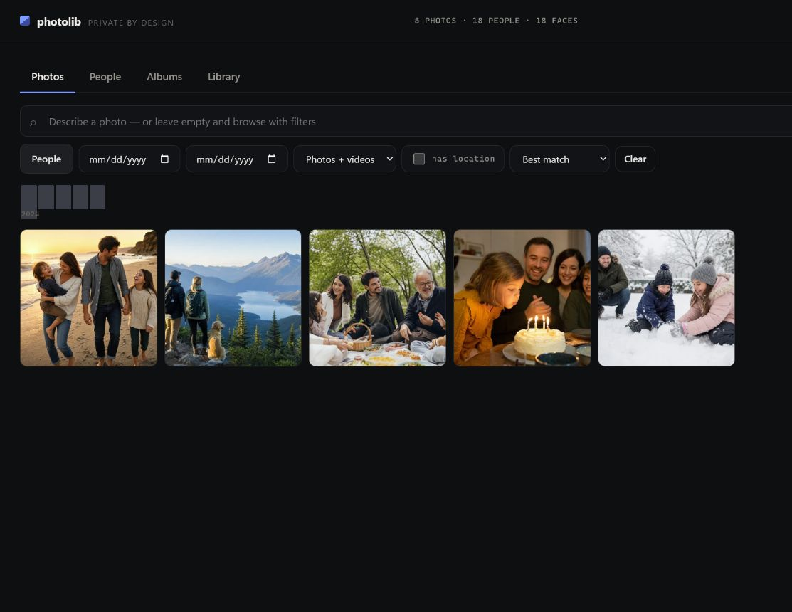
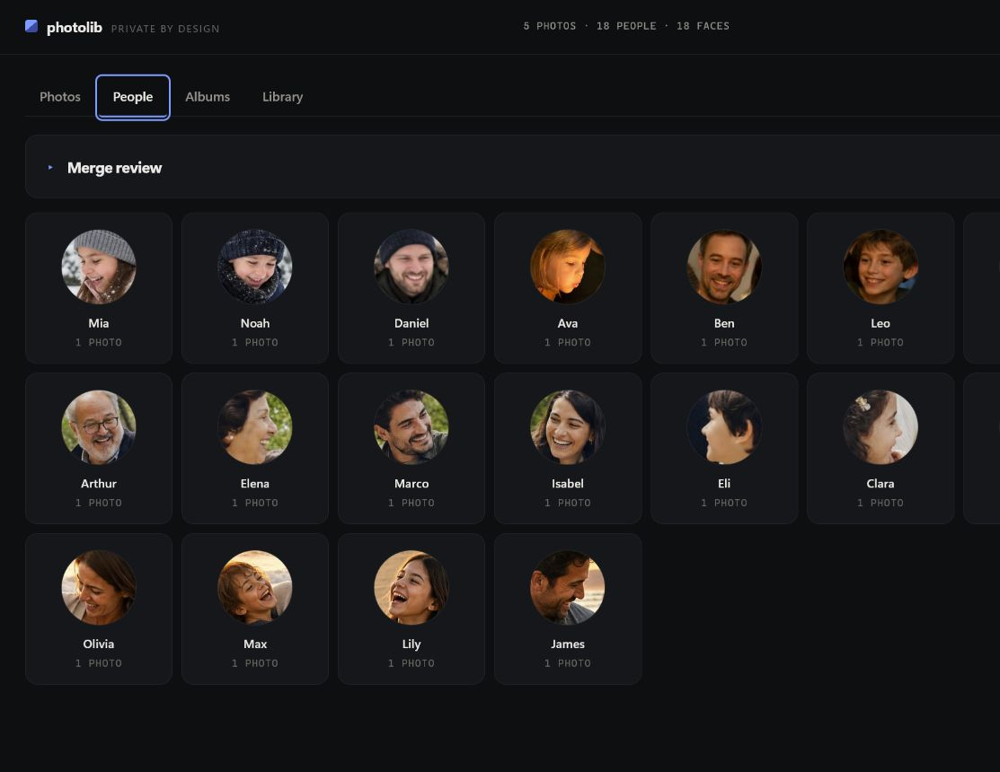

# photolib

**Your moments, easy to find — without sending them anywhere.**

Photolib is a private, local photo library for Windows. Search in plain
language ("kids at the beach at sunset"), browse by person, date, or place,
and organize albums in a desktop app built for real family libraries of
100,000–200,000 photos and beyond.



> The screenshots use a small, fictional AI-generated demo library. Your own
> photos stay on your computer.

## What it does

- **Natural-language search** — SigLIP 2 image/text embeddings, so you can
  describe a photo instead of remembering when you took it.
- **Face search and recognition** — every detected face is indexed
  individually. Find someone by clicking their face, by picking a person, or
  by uploading a photo of them ("who is this?").
- **People management** — name people, merge identities that got split,
  split ones that got merged, and confirm suggestions face by face.
- **Reverse image search** — upload a photo, find it (and things like it) in
  your library.
- **Duplicate detection** — exact copies via content hash, re-encodes and
  burst shots via perceptual hash.
- **Date, place, folder, and person filters** with a month-by-month timeline.
- **Incremental indexing** — point it at a folder as often as you like; only
  new and changed files cost anything.



## Installing it

Download the current **Windows x64 setup** from the
[Releases page](https://github.com/T-Lind/photo-library/releases/latest).
Nothing else is required: no Python, Node.js, account, or API key.

1. Close Photolib if an older copy is running.
2. Run `photolib-2.0.0-windows-x64-setup.exe`.
3. Open **photolib** from the Start menu and choose a photo folder.

The app installs for the current Windows user and leaves your library data
alone during upgrades. The setup is not code-signed yet, so Windows may show
a Microsoft Defender SmartScreen prompt; choose **More info** and then
**Run anyway** if you downloaded it from this repository. The download is
large because it includes the offline image-search model.

This release currently provides Windows x64. See [PACKAGING.md](PACKAGING.md)
for the cross-platform build configuration and source packaging instructions.

**Want to run it from source?** Read on.

## Quick start

```bash
./setup.sh                                   # venv + dependencies
source .venv/bin/activate

python -m photolib.cli index ~/Pictures      # index (recursive, incremental)
python run.py                                # API on http://127.0.0.1:8000
```

Then open <http://127.0.0.1:8000/docs> for the API, or run the frontend.

Searching from the terminal works too:

```bash
python -m photolib.cli search "birthday cake with candles"
python -m photolib.cli stats
python -m photolib.cli duplicates
python -m photolib.cli models status     # what weights are installed
python -m photolib.cli verify-model      # ONNX runtime still matches 🤗
```

## Does it use the internet?

At runtime, no. Search, indexing, face matching, and thumbnails all run
against local files. Your photos never leave the machine.

There is exactly one network request, and only when you trigger it: the face
recognition weights (~290 MB) are downloaded once, on first use, from the
InsightFace project's release page. `GET /api/v1/admin/models` shows the URL,
size, and licence before anything is fetched, and `PHOTO_OFFLINE=1` refuses it
entirely for an air-gapped install.

From source, the first run also downloads the image/text model from Hugging
Face. The packaged app bundles it instead, so it is offline from first launch.

Beyond that: `HF_HUB_OFFLINE` and `TRANSFORMERS_OFFLINE` are set so the ML
libraries cannot contact a model hub behind the app's back, Next.js telemetry
is disabled in every build script, and the UI uses a system font stack rather
than a web font. The only outbound request the UI can make is opening
OpenStreetMap in your browser if you click a photo's coordinates — no map
tiles are loaded in-app.

## Models

| Role | Default | Why |
|---|---|---|
| Image / text | `google/siglip2-base-patch16-224` | Better zero-shot retrieval than OpenAI CLIP at the same size, Apache-2.0, runs offline |
| Image / text (packaged) | the same model, exported to ONNX | Drops PyTorch entirely: ~500 MB installer instead of ~3 GB |
| Faces | InsightFace `buffalo_l` (RetinaFace + ArcFace `w600k_r50`) | Far more accurate than dlib on profiles, poor light, and children; batched ONNX inference with optional GPU |

Both are swappable through configuration. Larger embedding models are a
one-line change if you have a GPU:

```bash
# best quality, ~1.1 GB, 1152-dim
PHOTO_EMBED_MODEL=google/siglip2-so400m-patch14-384 python -m photolib.cli index ~/Pictures --rebuild

# OpenCLIP / LAION / MetaCLIP checkpoints
PHOTO_EMBED_BACKEND=open_clip PHOTO_EMBED_MODEL=ViT-H-14-quickgelu:dfn5b ...
```

Changing the embedding model invalidates the stored vectors, so it requires
`--rebuild`. The library refuses to index with a mismatched model rather than
silently mixing incompatible vectors.

## Configuration

Every setting is an environment variable (or a line in `.env`).

| Variable | Default | Purpose |
|---|---|---|
| `PHOTO_DB_URI` | `data/library` | LanceDB location |
| `PHOTO_THUMBNAIL_CACHE_DIR` | `data/thumbnails` | Thumbnail + face-crop cache |
| `PHOTO_STATE_DIR` | `data/state` | Background job records |
| `PHOTO_EMBED_BACKEND` | `siglip` | `siglip`, `clip`, `open_clip`, `onnx`, `stub` |
| `PHOTO_ONNX_MODEL_DIR` | `models/siglip2-base` | Exported model dir, for `onnx` |
| `PHOTO_OFFLINE` | unset | Refuse every download, even model weights |
| `PHOTO_WEB_DIR` | bundled | Built web UI to serve from the API process |
| `PHOTO_EMBED_MODEL` | `google/siglip2-base-patch16-224` | Model id |
| `PHOTO_FACE_BACKEND` | `insightface` | `insightface`, `dlib`, `none` |
| `PHOTO_DEVICE` | `auto` | `auto`, `cuda`, `mps`, `cpu` |
| `PHOTO_EMBED_BATCH_SIZE` | `16` | Raise on a GPU |
| `PHOTO_FACE_MATCH_THRESHOLD` | `0.38` | Cosine similarity to join an existing person |
| `PHOTO_FACE_STRONG_MATCH_THRESHOLD` | `0.55` | Similarity that needs no corroboration |
| `PHOTO_FACE_CLUSTER_THRESHOLD` | `0.42` | Threshold for a full recluster |
| `PHOTO_MAX_CANDIDATES` | `1000` | Ranked candidates kept per semantic search |
| `PHOTO_NPROBES` / `PHOTO_REFINE_FACTOR` | `24` / `8` | ANN accuracy vs speed |
| `PHOTO_CORS_ORIGINS` | `http://localhost:3000` | Comma-separated |
| `PHOTO_HOST` / `PHOTO_PORT` | `127.0.0.1` / `8000` | Bind address |

If faces are being split across too many people, lower
`PHOTO_FACE_MATCH_THRESHOLD` and run `photolib recluster`. If different
people are being merged, raise it.

## API

Everything is under `/api/v1`. Full schema at `/docs`.

**Search**
- `POST /search` — semantic + person + date + location + folder, paginated
- `GET  /search?q=...` — the same, as a bookmarkable URL
- `POST /search/by-image` — reverse image search from an upload
- `GET  /timeline`, `GET /folders`

**Images**
- `GET /images/{id}` — the original file
- `GET /images/{id}/thumbnail?size=grid&format=webp` — cached, ETagged
- `GET /images/{id}/details` — metadata, people, and face boxes
- `GET /images/{id}/similar` — visually similar photos
- `GET /images/{id}/faces`

**People**
- `GET/PATCH/DELETE /people/{id}`, `GET /people`
- `POST /people/merge`, `POST /people/{id}/hidden`
- `GET /people/{id}/suggestions` — unassigned faces that look like them

**Faces**
- `POST /faces/search` — by `face_id` or `person_id`
- `POST /faces/search/by-upload` — "who is this?"
- `POST /faces/assign` / `POST /faces/detach` — corrections
- `GET /faces/unassigned` — the review queue
- `GET /faces/{id}/crop`

**Admin**
- `POST /admin/index` — background indexing, returns a job id
- `POST /admin/recluster`, `POST /admin/compact`
- `GET  /admin/jobs`, `GET /admin/jobs/{id}`, `DELETE /admin/jobs/{id}`
- `GET  /admin/models`, `POST /admin/models/fetch` — weight status and download
- `GET  /admin/duplicates`, `GET /stats`, `GET /health`

If a built UI is present (bundled, or `PHOTO_WEB_DIR`), the API also serves it
at `/`. That is how the desktop app runs as a single process on one port.

## How it scales

The design targets a library that does not fit in a naive query pattern.

**Browse index.** A columnar NumPy snapshot of image id, capture date,
people, coordinates, and face count lives in memory — about 6 MB for 200k
photos. Filtering, sorting, and pagination happen there, and only the ~60
rows actually on screen are read from the database. Jumping to page 3000
costs the same as page 1.

**Search.** Vectors are stored L2-normalised and indexed with cosine
distance, which is what SigLIP and ArcFace are trained for. IVF_PQ parameters
are sized from the row count (~√n partitions); below a few thousand rows the
index is skipped because a brute-force scan is genuinely faster.

**Faces.** Each face is a row with its own embedding, bounding box, and
quality score, so "every photo with this face" is one ANN query. Identity
assignment is incremental and does bounded work per face — see
[Face recognition](#face-recognition) below.

**Indexing.** Each photo is decoded exactly once and the same buffer feeds
the embedder, the face detector, the perceptual hash, and the thumbnail
writer. Metadata and IO run on a thread pool while model batches run on the
accelerator. Work is committed in batches, so an interrupted run resumes.

**Thumbnails.** WebP, generated on demand and cached in sharded directories
(no single directory ever holds 200k files), served with strong ETags so a
scrolling grid revalidates instead of re-downloading.

## Face recognition

The face system is the part that most affects how the library feels, so it is
worth describing what it actually does.

Every detected face gets an ArcFace embedding, a bounding box, and a
**quality score** combining detector confidence, face size, and sharpness.
Identity assignment then works like this:

1. Score the face against every person's **centroid** (a quality-weighted
   mean, so a blurry background face cannot drag a person's model around).
2. Refine the top few candidates against that person's best **exemplar
   faces**. People change with age, lighting, glasses, and facial hair; a
   single mean vector cannot represent that, and nearest-exemplar matching
   can.
3. Assign if the best match is confident, or if it clears the threshold with
   a clear lead over the runner-up.
4. If two candidates are nearly tied, still show the photo under the best
   one — but do not let that face update either person's model. Guessing and
   then learning from the guess is how clusters degenerate into one blob.
5. Faces too small or blurry to identify never create a new person, which is
   what stops a library from sprouting thousands of one-photo strangers.
6. Two faces in the same photograph are never assigned to the same person.

Corrections you make are marked **confirmed** and are treated as ground truth
by any later reclustering, so fixing a mistake makes it stay fixed.

`photolib recluster` rebuilds every identity from scratch using a
**mutual-kNN graph** — two faces are linked only when each is in the other's
top-k neighbours *and* they clear the similarity threshold. Requiring
mutuality is what prevents the chaining failure where a handful of ambiguous
faces merge two people into one cluster.

## Development

```bash
python -m venv .venv && source .venv/bin/activate
pip install -r requirements-dev.txt
pytest
```

The suite runs against a real LanceDB database with synthetic photos and
stub models, so it needs no model downloads and finishes in a few seconds.
It covers indexing, incremental updates, clustering behaviour, search
ranking, filtering, pagination, the HTTP layer, and scaling of the browse
index at 200k photos.

## Requirements

- Python 3.10+
- ~2 GB of disk for model weights on first run
- A GPU is optional. On CPU, expect roughly 3–10 photos/second for the
  initial index; incremental runs only touch new files.

## Migrating from v1

The schema changed (per-face rows, numeric coordinates, normalised vectors),
and the old face-cluster JSON sidecar is gone. Re-index once:

```bash
python -m photolib.cli index ~/Pictures --rebuild
```

## Licence

MIT.
